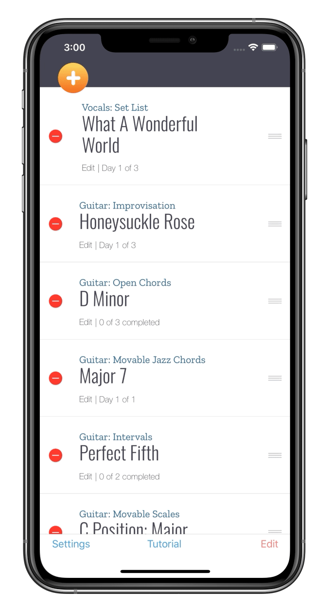

  
<!--
Badges
-->
[![Platform][mlw-badge]][repo]&nbsp;
[![GitHub issues][issues-badge]][issues]&nbsp;
[![GitHub license][license-badge]][license]&nbsp;
[![Code of Conduct][coc-badge]][coc]&nbsp;

<!--
Badge References
-->
[mlw-badge]:https://img.shields.io/badge/platform-iOS-8056d5.svg?style=for-the-badge&logo=apple&logoColor=white
[issues-badge]:https://img.shields.io/github/issues/cmilr/core-restore.svg?style=for-the-badge&logo=github&logoColor=white
[license-badge]:https://img.shields.io/github/license/cmilr/core-restore.svg?style=for-the-badge
[coc-badge]:https://img.shields.io/badge/code%20of-conduct-ff69b4.svg?style=for-the-badge

<!--
URL References
-->
[repo]:https://github.com/cmilr/core-restore
[issues]:https://github.com/cmilr/core-restore/issues
[license]:https://github.com/cmilr/core-restore/blob/master/LICENSE
[coc]:https://github.com/cmilr/core-restore/blob/master/CODE_OF_CONDUCT.md

CoreRestore is a Swift library allowing you to easily add **backup and restore** functionality to iOS apps that employ Apple's Core Data. I built this library because I wanted the users of my apps to be able to easily restore their data to a previous state should the need ever arise.

**⚠️ NOTE ⚠️** This project is still a very early work-in-progress—it's currently getting battle-tested in the beta release of my app [Dalilah](https://cmillerco.com/dalilah)—but I hope to have this README better fleshed out in the coming weeks, including detailed installation and usage info. Thanks for your patience.

## Contact
- Email: cary@cmillerco.com
- GitHub: [cmilr](https://github.com/cmilr/)

## License
***CoreRestore*** is distributed under the MIT license. See ``LICENSE`` for more information.

# Thanks for stopping by!
